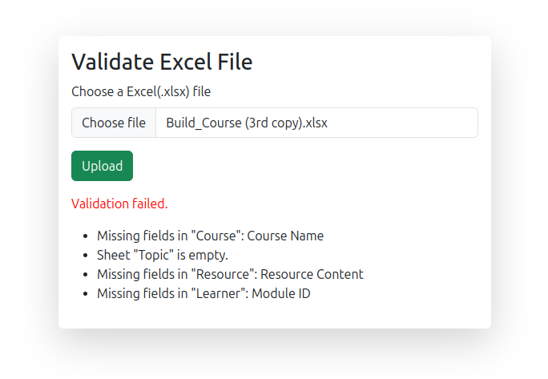

# Navigate Learning Backend

## Initial Setup

```bash
python3 -m venev .venv
source .venv/bin/activate

pip install requirements.txt
```

Create a file `.env` by copying contents of `.env.template` and making necessary changes.

## Run Server

```bash
python3 app.py
```

Visit http://localhost:5000

---

## Demo

### On Success
```json
{
    "message": "Validation successful."
}
```

### On Failure
```json
{
    "details": [
        "Missing fields in \"Course\": Course Name",
        "Sheet \"Topic\" is empty.",
        "Missing fields in \"Resource\": Resource Content",
        "Missing fields in \"Learner\": Module ID"
    ],
    "message": "Validation failed."
}
```

